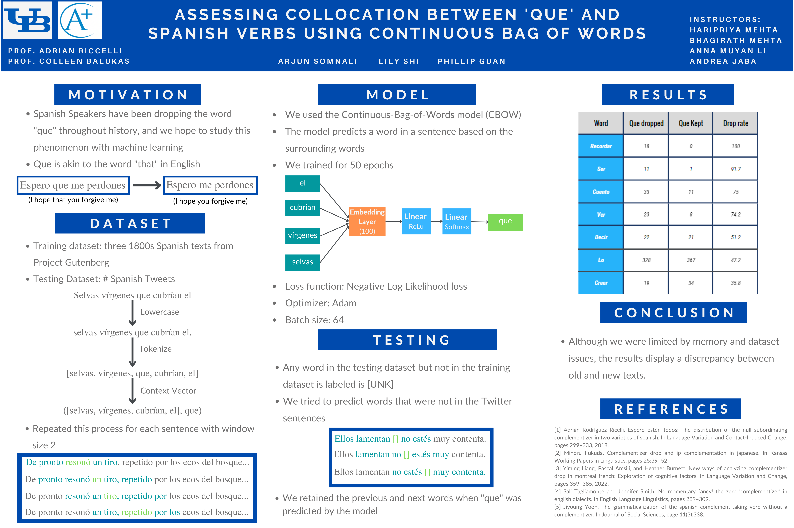
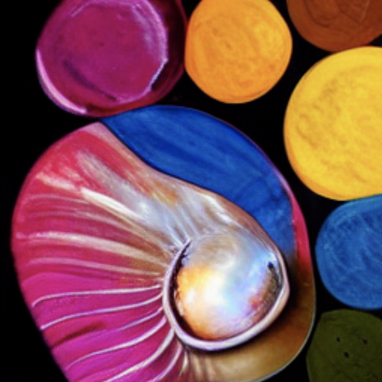

# MehtA+ Student Projects

 
  
  
 

This github repo showcases the projects of MehtA+ students from our various camps. Please note that projects from all camps may not be featured since some of the students' projects are in collaboration with startups and or with universities in active areas of research and cannot be published online. 

For more information on all our camps, please check our [website](https://mehtaplustutoring.com/).

## Student Projects 

Please navigate to the camp that you are interested in and look through the various years for past projects. 

[AI/Machine Learning Research Bootcamp](aimlresearchbootcamp) - 6-week bootcamp offered in the summers where students learn the theory and application of AI and machine learning and then apply these techniques to a digital humanities or science project with a real world impact

[AI in Visual Arts Camp](aiinvisualarts) - 1-week camp offered in the summers where students learn the application of AI in visual arts and then create their own AI+Art galleries and pitches for an AI+visual arts startup.

## Internship-focused camps

We teach internship-focused camps as well in the fall/spring (certain years) in conjunction with a startup/university where students work on a final project that will eventually be used by tens of thousands of users. 

*App Development Bootcamp* - Fall camp where students learn how to create an app using React Native for Android and iOS platforms and publish a mobile app for a startup/university

*Data Visualization Bootcamp* - Fall camp where students learn the science of data visualization using d3.js and create a data visualization for a startup/university

*Web Development Bootcamp* - Spring camp where students learn how to create a website on WordPress using HTML and CSS fundamentals and publish a website for a startup/university

## Workshops

We teach 1.5 hour workshops in the fall (certain years) to students individually or in conjunction with organizations. Please reach out to us if you are interested in holding a workshop for your organization.

*JavaScript Fall-themed Animations using p5.js*

*Python Animal-themed game using Pygame*

*Halloween-Themed Mobile App using React Native*

*Augmented Reality Turkeys using Unity and Vuforia*

*Holiday-themed Digital Greeting Cards using HTML, CSS*

*Graph Theory Math Mystery Theater*

## Talks

We also give free talks to non-profits on various topics (artificial intelligence, profile-building for university applications, staying motivated as a student, journey as a female in STEM, etc.) so please reach out to us if you are interested in hosting a talk.

If you have any questions, please reach out to info@mehtaplustutoring.com and make sure to join our mailing list!

