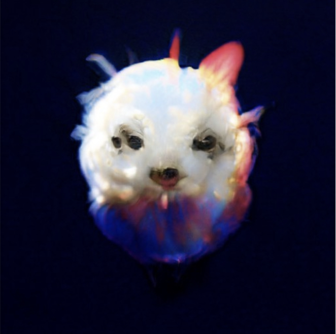
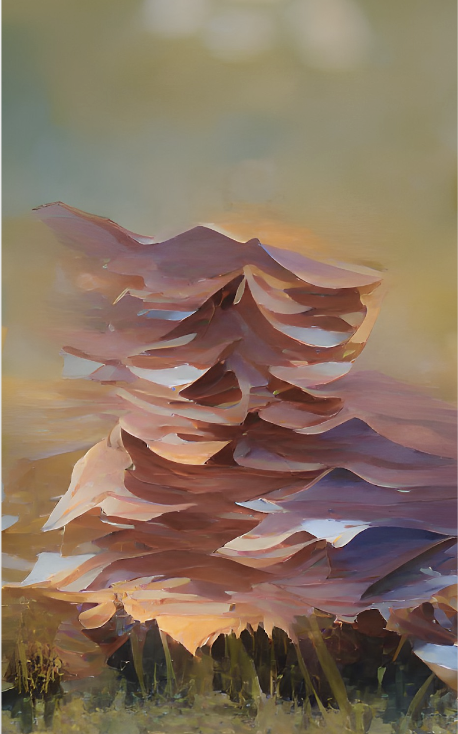
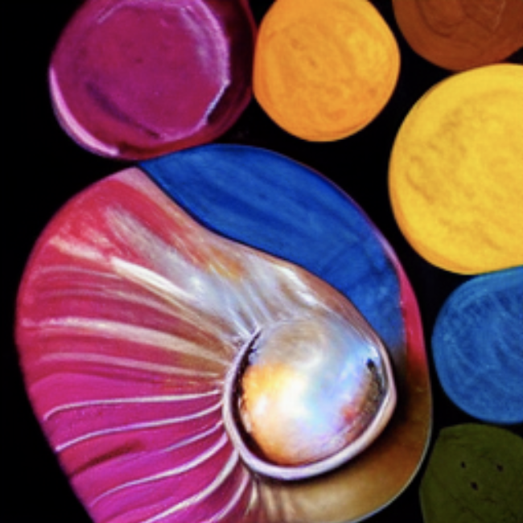

# MehtA+ AI in Visual Arts Projects

 
  
  
  
 

Each summer, MehtA+ offers a 1-week AI in Visual Arts Camp where students learn the application of AI in visual arts and then create their own AI+Art galleries and pitches for an AI+visual arts startup. 

 
  
 

High school student Erin Y received 2nd Place Award at the the 2022 National Chemistry Illustrated Poem Contest (American Chemical Society) for the digital art she created using DALLE-2 after learning about it in MehtA+ AI in Visual Arts camp!

## Student Projects 
Click on the different years to check out the past projects for AI in Visual Arts camp. We have posted students' art galleries and startup pitches. 

[Past Projects - 2022](2022)

If you have any questions, please reach out to info@mehtaplustutoring.com and make sure to join our mailing list!
