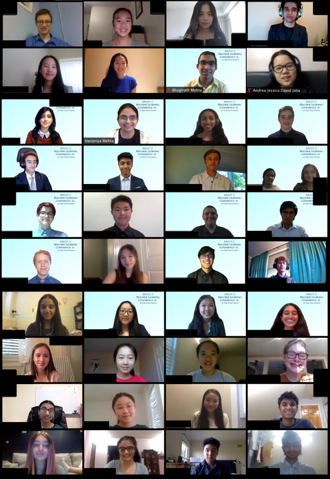

  

## Final Projects

### **Handwriting Recognition with Convolutional Neural Network on Writings by George Washington** 

*Team SeaMLless StAIrwells: Ryan B, Dev D, Peter T, Jaydev Z*

Abstract: Handwriting style is a characteristic unique to every human being, and as such it is an important identifier to distinguish one person’s writing from another’s. This ability to distinguish handwriting styles is especially important to archaeologists and historians when identifying handwritten historical documents. However, handwriting styles are complex, with many writer-specific features, prompting us to question if machine learning could perform well at identifying whether a document was written by some historical figure. This Authorship Verification project implements a Convolutional Neural Network (CNN), in conjunction with binary pixel normalization and random image cropping, to solve the problem of determining whether or not a particular historical figure authored a written document. The model was trained to distinguish the handwriting of George Washington from the unique and diverse handwriting styles of 657 unknown individuals. The intended use of the model was to differentiate between Washington’s handwriting and that of anyone else. In summary, the model performed well with a testing accuracy of 99.7% and proved that CNNs can be used for the binary mapping of handwriting samples to authorship.

[Link to Website](https://mehtaplustutoring-mlbootcamp20.github.io/SeaMLlessStAIrwells/)

### **Early Detection of Alzheimer’s Disease With Convolutional Neural Networks**

*Team AI-zheimer’s: Mehar B, Maya C, Abigail T, Mira C* 

Abstract: Alzheimer’s disease is a progressive brain disease that interferes with memory and normal brain function and is the sixth leading cause of death in the United States. The key to combating this disease is early detection. This project applies machine learning algorithms on a dataset with 6,400 MRI brain scans to train highly accurate models to predict the stage of the disease. These models can help detect early stages of Alzheimer’s disease and set patients on a path to recovery, which can help combat this widespread problem.

[Link to Website](https://mchandrakasan.github.io/alzheimers-detection/)

### **Sentiment Analysis on COVID-19 Related Tweets**

*Team Deep Learning COVID-19 Sentiment: Arianna C, Dominic C, Harshini M, Claire Z*

Abstract: The recent COVID-19 pandemic has drastically altered life on a global scale. Authorities rely on accurate reports of confirmed cases to make decisions on the well-being of citizens. During these times, there is also a growing reliance on social media for citizens in quarantine to communicate their opinions and sentiments on their current situations. This project applies models such as Logistic Regression, Support-Vector Machine, Naive Bayes, and Stochastic Gradient Descent to classify COVID-19 related tweets with a sentiment of -1, 0, 1, meaning negative, neutral, and positive, respectively. In doing so, we found an inverse relation between the average sentiments of Twitter users in a specific location to the number of cases in that area at a given date.

[Link to Website](https://dlharshini.github.io/Covid-19-Sentiment/)

### **Deep Learning Techniques for Melanoma Classification**

*Team MLnoma: Preeti G, Isabelle H, Minnie L, Mohammad S*

Abstract: The most common cancer globally is skin cancer. Early detection of skin cancer can drastically increase patient survival rates; therefore, a computerized image classification system of skin lesions can save time and by extension human life. In this paper, we elevate a traditional unimodal model which inputs only images into a CNN into a state-of-the-art multimodal model which concatenates the CNN image model with metadata features. Our results show that our multimodal model outperforms the unimodal model by a 9.5% increase in accuracy. We further improve our model by exploring various CNN architectures, specifically ResNet-18 and VGG16. Our accuracies increases when using ResNet-18, and we confirm these results by applying the Grad-CAM algorithm on our skin lesion images.

[Link to Website](https://mehtaplustutoring-mlbootcamp20.github.io/Melanoma_Classification/)

### **The Imitation Game: Style Transfer Generative Adversarial Networks for Non-Grand Chess Masters**

*Team GANMasters: Matthew M, Noah R, Gustavo S, Jeffrey W*

Abstract: STGANs (Style Transfer Generative Adversarial Network) was previously applied to professional chess players in an attempt to imitate their style. However, we attempted to apply STGANs on to casual players instead, to see whether STGANs could successfully imitate casual players, due to casual chess players making more diverse and intricate decisions. We used one of the author’s friend’s chess games to train the STGANs model, and the author judged the model’s performance in a chess match based on how similar the style was to the author’s friend. We found that when the loss was increased, it began to more closely imitate the friend as well as improve at chess overall. However, as the loss got too great the model began copying moves from its training.

[Link to Website](https://mehtaplustutoring-mlbootcamp20.github.io/GanMasters/)

### **Sentiment Analysis and Stock Price Prediction: An Investigation of a Tweet-Based Dataset**

*Team NYSE:TMS: Srijan D, Tanusri M, Michelle Z*

Abstract: Analysis on stock market movements has become a popular area of investigation, and despite prior beliefs, public opinion has been proven to have an impact on the movement of the stock market. In this paper, we apply sentiment analysis to a tweet-based dataset to investigate the how public sentiment can be used to predict stock market movements. Using a Naive Bayes Classifier and a linear regression model, we predicted the following day’s opening stock price. On average, we achieved an accuracy of 52.2% in predicting the direction of the ten different companies’ opening stock prices for the next day.

[Link to Website](https://srijandeoraj.github.io/TMS/index.html)

### **Analyzing Authorship of Disputed Federalist Papers using Unsupervised Machine Learning**

*Team Fresh Pages: Ishita A, Sushant K, Alice L, Saathvik S*

Abstract: One of the most important topics in the field of Natural Language Processing is authorship attribution, which deals with texts whose authorship is uncertain. It mainly focuses on writing style instead of topic matter. We use computational stylometry to convert given sets of text into numerical values that can then be processed and analyzed using various models. These numerical values usually represent lexical, syntactic, and/or semantic features. This paper discusses our approach to solve the controversy over authorship for several of The Federalists Papers by utilizing an unsupervised machine learning algorithm for authorship attribution. After prepossessing each paper, we extracted two features from the articles- TF-IDF and punctuation count frequencies. Then, we trained a KMeans clustering model on a matrix consisting of the features from articles with known authorship. The accuracy of this model was 81.82%.To predict the authors of contested papers, we ran their collected features through our KMeans model and matched the resulting labels with the labels of our known papers. From doing so, We found that the majority of the documents were authored by Hamilton.

[Link to Website](https://mehtaplustutoring-mlbootcamp20.github.io/FreshPagesWebsite/)

### **Music Generation**

*Team Music Gen: Ben K and Lily B*

Abstract: For this project we decided to do music generation using machine learning. We put a few songs into our code to produce the end product of the mashup we were looking for. We had two different models, one for the right ear and one for the left. In this project you will see how we made a mashup of three songs.

[Link to Website](https://mehtaplustutoring-mlbootcamp20.github.io/Music_Generation/)

### **Detecting Fake News using Support Vector Machines**

*Team Real vs Fake News: Bradley A, Rachel K, Rachel S, Jonathan S*

Abstract: In recent years, fake news has emerged as a threat to credible, reliable news. Recent improvements in the capabilities of AI to generate fake news have made it easy to generate realistic but fake news articles that can misinform the public. To help differentiate between real and fake news articles, this paper proposes an SVM model that classifies articles with 89% accuracy based only off the title, and a 98% accuracy with the title and the first 1000 characters. This high level of accuracy could allow for systems that scan social media or other platforms quickly to flag suspicious articles.

[Link to Website](https://mehtaplustutoring-mlbootcamp20.github.io/Real_vs_Fake_News/)

### **Analyzing Supervised Learning Methods for Credit Card Fraud Detection**

*Team MasterFraud Discovery: Jennifer G, Karen S, Grace T*

Abstract: Credit card fraud has been a growing issue both in the United States and worldwide. Unfortunately, the countless losses caused by fraudulent transactions are usually paid for by the sales companies and credit card companies. This project analyzes supervised machine learning models for identifying fraudulent transactions based on the transaction information. In doing so, we have worked with three models: decision tree, KNN, and random forest, analyzing both the individual models and all possible combinations of models. A final fraud score is calculated as a probability of fraud based on all models, which achieved a recall of 82% with a precision of 84%. Our final model is a probability and not an absolute decision of fraud, which can allow credit card companies to factor in personal concerns when deciding their course of action in response to possible future frauds.

[Link to Website](https://mehtaplustutoring-mlbootcamp20.github.io/CreditCardFraud/)

### **Latin Translation with Machine Learning**

*Team Interpretes Linguae Latinae: Susan S, Summer Z, Zoe Z*

Abstract: This paper presents a neural translation model for Latin. Given the lack of accurate translations and resources in accessible corpora, Latin is arguably one of the most difficult languages for which to implement an accurate automated translation model. However, by finding vocabulary, phrases, and sentences with different complexity levels ourselves and cleaning it both manually and through programming, our model has achieved 96% accuracy in Latin translation. Our experimental results show that the proposed model performs better on vocabulary and short phrases, but not as well for long, complex sentences, and thereby achieves a noticeable BLEU score improvement on Latin-English translation tasks compared to the Google Phrase-Based Neural Machine Translation model.

[Link to Website](https://mehtaplustutoring-mlbootcamp20.github.io/Latin-Translation-/)
