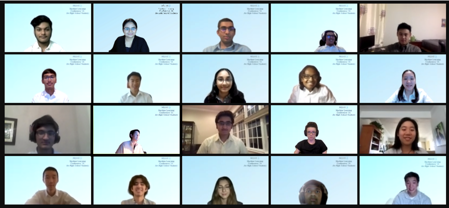

  

## Final Projects
Note: Some posters and papers have not been published on our website according to professors’ request as these are areas of active research.

### **¿Qué?: A neural network’s assessment of the collocation between null complementizers and Spanish verbs** 

*Team A-o-que!: Isaac A, Olivia B in conjunction with University of Buffalo, SUNY*

Abstract: In a sentence, a null complementizer is a complementizer expected to be present when there is not one. Throughout history, Spanish speakers have steadily been dropping complementizers out of their sentences. Although linguists have attempted to study this phenomenon, the process is tedious. Thus, this paper uses computational power and machine learning in hopes of significantly quickening the procedure. We performed two analyses. First, by consolidating the corpora in a Pandas dataframe, we found that volitional verbs have que following them the least often, which agrees with prior linguistic research. Our second analysis utilized a LSTM(Long Short-Term Memory) machine learning model to learn not only the syntax but the semantics of Spanish. Testing on a portion of untrained corpora, our model predicted if que followed a verb with 74.25% accuracy.

[Link to Poster](Que_Poster.pdf)

[Link to Paper](Que_Paper.pdf)

### **Dating Giacomo Leopardi’s Texts (by Handwriting Recognition) using Convolutional Neural Networks**

*Pradyun S, Aadhavan N, Nakul S in conjunction with University of Bologna (Italy)* 

Abstract: We present a Convolutional neural network model that is able to date Zibaldone, a diary of Giacomo Leopardi, from 1817 to 1820. The model was trained on many different works and manuscripts of Giacomo that were all labeled from 1817 to 1820. Of the data-set we used 60% for the training the model, 20% for validation, and 20% for testing. The pre-processing of the data we did included first cropping out most of the backgrounds of all the images, which we did manually. We then wrote code that slices the images into 48 x 48 pixel squares. Then, we manually went through all the images and discarded the ones that were not suitable. The remaining 48×48 pixel images were used to train the model and date Zibaldone. The model had an accuracy of 87.28% and dated Zibaldone as most likely being written in 1819.

[Link to Poster](Giacomo_Poster.pdf)

[Link to Paper](Giacomo_Paper.pdf)

### **Calculating Latin Readability Scores Using Linear Regression**

*Amanda L, Surya K, Dylan S in conjunction with Haverford College*

Abstract: Readability scores are important in order to help students and teachers determine which texts are best for them to read. Although many such scores exist for English, there are no commonly used scored for Latin. Using a labeled dataset with associated LexR scores, machine learning and linear regression is used to predict the readability scores for additional Latin texts.

[Link to Poster](Latin_Poster.pdf)

[Link to Paper](Latin_Paper.pdf)

### **Unsupervised Machine Learning in 20th Century Attribution of Italian poetry: Montale or Cima?**

*Abdulaziz K, Nimish B, Kabir G in conjunction with University of Bologna (Italy)*

Abstract: In this paper, authorship attribution in Italian poetry will be conducted to determine the authorship of a specific poem after poems with recognized authorship have been collected. When a poet writes, (s)he creates a unique “signature” based on the words and sentences they chose to include. The model will attempt to identify that signature and attribute it to the correct author. The model in question is the K-Means model, which suits this project perfectly. In the experiment, a set of 115 Montale poems and 140 Cima poems were used. The highest accuracy value for the model is 85%.

[Link to Poster](Montale_Poster.pdf)

[Link to Paper](Montale_Paper.pdf)

### **Morality Analysis on Tweets Following Terrorist Attacks Using Natural Language Processing**

*Muyan L, Siddarth K, Danny L, Hana H in conjunction with University of Buffalo, SUNY*

Abstract: Previous research has shown that after a terrorist attack, people demonstrate an increase in salience of moral institutions such as the respect for authority and purity due to the need for social cohesion. Using sentiment analysis and machine learning classification models on Twitter tweets after the El Paso terrorist attack and Las Vegas terrorist attack, we intend to extend the previous research on a bigger database in this research study. After hand annotating 900 tweets with each of five morality, we use Support Vector Machine (SVM) to classify the tweets into 5 moral intuitions. Comparing the percentage of tweets that express each moral foundation category, we find that our comprehension of the El Paso attack is aligned with the previous studies, but our conclusion of the Vegas attack does not. This paper documents how we utilize machine learning models to classify people’s morality and record our findings on the sentiment of tweets after a terrorist attack.

### **Topic Modelling on Novels of Different Lengths Using Latent Dirichlet Allocation**

*Alec S, Daniel S, Justin W in conjunction with Kenyon College*

Abstract: By performing topical analysis models on fictional novels such as Sherlock Holmes, Harry Potter, To Kill a Mocking Bird, and The Book of Negroes, we discovered multiple topics and words in the book associated with the topics. As we optimize our model, machines will be able to recognize topics many humans could do, and perhaps even expand upon human knowledge on topics and connections within certain stories. Thus, we explored using state-of-the-art TF-IDF model in conjunction with Latent Dirichlet Allocation (LDA) on novels of varying lengths in attempt to 1. affirm in novels of what length can the model identify topics accurately and 2. optimize the number of topics so the model can produce ideal results. Although we tried many other models, including normal LDA, LDAMulticore, LDAMallet, and Hierarchical Dirichlet Process (HDP), we found that our model with TF-IDF generated results dominating that of other models.

## Mid Projects
For their mid project, students worked together in groups to determine geographical entities in American poet Marianne Moore’s poems through machine learning. A variety of methods were used, including Named Entity Recognition, Word2Vec and LDA. Each group created a website displaying their methodology. 

Team 1 – [Link to Website](https://amklin.github.io/Midterm-project.github.io/)

Team 2 – [Link to Website](https://mehta-tutoring-dhmlbootcamp21.github.io/GitGood/)

Team 3 – [Link to Website](https://mehta-tutoring-dhmlbootcamp21.github.io/Nimish-Hana-Danny/)

Team 4 – [Link to Website](https://alecishuman.github.io/locationfinder.github.io/)

Team 5 – [Link to Website](https://kabirgoel.github.io/Midterm-Project/)

Team 6 – [Link to Website](https://mehta-tutoring-dhmlbootcamp21.github.io/Pradyun-Aadhavan/)

Team 7 – [Link to Website](https://mehta-tutoring-dhmlbootcamp21.github.io/Midterm-Liv_Nakul/)
