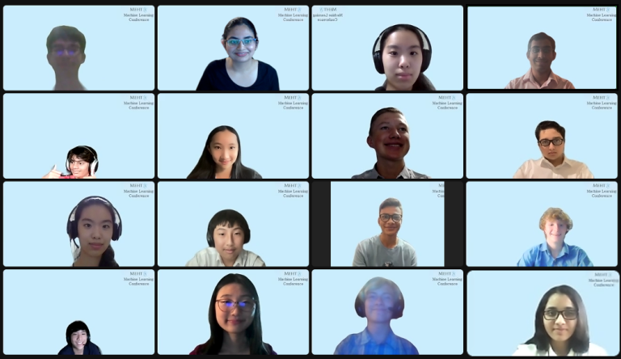

  

## Final Projects

### **Identifying Geographical Locations in Marianne Moore’s Poems Using Named Entity Recognition** 

*Team Disco Lawyers: Spencer Anderson, David Aidan Dugan-Lazo, Ivy Guo in conjunction with University of Buffalo, SUNY*

Abstract: Marianne Moore, an American poet from the 20th century, refers to many geographical entities in her poetry. However, she doesn’t always refer to locations using their proper names. We aimed to identify all the lines of a poem that refer to geographical entities that Moore mentions throughout her poems. Although we have no way to measure accuracy, we found that using named entity recognition (NER) on scraped Wikipedia pages to identify possible locations a word refers to and then filtering these locations with word2vec gives us surprisingly reasonable results.

[Link to Poster](MarianneMoore.jpeg)

[Link to Paper](MarianneMoore.pdf)

### **Agri-Learning: Diagnosing Plant Diseases using Convolutional Neural Networks**

*Team Agri-Learners: Kamakshi Bali, Alex Xie, Maahir Doshi* 

Abstract: Agriculture plays an imminent role not just for farmers, but for the entire world. One of the major problems farmers face is disease attacks which lead to plant loss and reduction in plant growth. These losses can be reduced by monitoring the health of the crop plant and keeping track of any disease the plant is susceptible to or has developed. Image recognition is the most recent and optimal method to detect any plant diseases. This project explores the usage of convolutional neural networks to predict diseases carried by the plant using pictures of leaves. We compare the performances of three models: a simple CNN model, a VGG-16 model, and a VGG-16 model pre-trained on ImageNet. The CNN and pre-trained VGG-16 model had the best validation accuracy of around 89%. We used Grad-CAM to understand the salient features that the model uses to classify the leaf images.

[Link to Poster](AgriLearning.jpeg)

[Link to Paper](AgriLearning.pdf)

### **Assessing the collocation between que and Spanish verbs using continuous bag of words**

*Team ¿Say Qué?: Arjun Somnali, Lily Shi, Phillip Guan in conjunction with University of Buffalo, SUNY*

Throughout the development of the modern language, the use of complementizers, words used to link a subject and a complement clause, has been steadily decreasing. The Spanish complementizer “que”, which translates to “that ” in English, is one such word that Spanish speakers have been dropping out of their sentences. We attempt to study this phenomenon performing analyses using a Continuous Bag of Words model (CBOW). We ran experiments with the model on two datasets from older and more recent time periods and developed a method to accurately find instances of que-drop and determine which words precede a que-drop the most.

[Link to Poster](Spanish.png)

[Link to Paper](Spanish.pdf)

### **Multi-Label Classification of Retinal Diseases Using Convolutional Neural Networks**

*Team ophthaMLologists: Yuriy Bidochko, Grace Choi, William Wu, Mushfiquzzaman Mahim*

Globally over 25% of the world has vision problems, particularly in the developing world. To combat this issue, we present a multi-class classification machine learning model that recognizes 4 different eye retinal conditions, diabetic retinopathy, age related macular degeneration, drusen, and retinal occlusion as well as healthy retinas. It is important to diagnose these diseases early on to reduce a patient’s risk of losing their vision and becoming blind. But compounded with the fact that the need for ophthalmologists is increasing yet human diagnosis takes time, we present an alternative method for detection. We looked at two pretrained convolutional neural networks (CNNs) which were VGG-16 and ResNet-18. The model was trained on over 2,000 color retinal fundus images that came from a combination of four separate datasets. Through experimenting, our model eventually achieved a 94% validation accuracy. Thus, our model holds promise as an efficient way to identify retinal diseases.

[Link to Poster](Retinal.png)

[Link to Paper](Retinal.pdf)

### **Predicting Weather-Related Flight Delays**

*Team Frequent Flyers: Olivia Guo, Shreyas Singh in conjunction with Singapore Institute of Technology*

This project is an attempt to predict the amount by which a given flight is delayed due to weather-related causes. We used a dataset on flight delays and their causes, and another about weather conditions in the US, and determined, for each plane, if its takeoff time is during a severe weather event. If so, we used the time between the end of the event and the departure, the time between the departure and the start of the event, as well as the type of weather event as features to try to predict the actual delay time due to weather. We tested two different models, KNN and SVM, to see which gave the better accuracy. Neither model was very successful due to a large number of confounding variables.

[Link to Poster](Airplanes.png)

[Link to Paper](Airplanes.pdf)

## Mid Projects
For their mid project, students worked together in groups to predict the gender of the author of a book and in the process, understand what stylistic features may be useful in trying to determine if an author of the book was male or female.

Students were provided a suggested corpus featuring 17th and 18th century science texts written by males and females.

A variety of methods and models were used, including Bag of Words, TF-IDF and Support Vector Machines. Each group created a website displaying their methodology. 

Team 1 – [Link to Website](https://mehta-ai-aimlresearchbootcamp22.github.io/midterm/)

Team 2 – [Link to Website](https://mehta-ai-aimlresearchbootcamp22.github.io/Midterm-Project/)

Team 3 – [Link to Website](https://mehta-ai-aimlresearchbootcamp22.github.io/MidTermProject/)

Team 4 – [Link to Website](https://mehta-ai-aimlresearchbootcamp22.github.io/Midterm-/)
