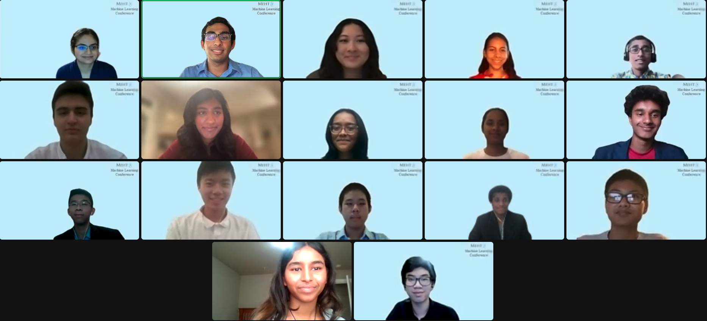

<!--

  

-->

## Final Projects

### **Multi-Label Classification for Thematic Grouping of Artworks** 

*Team Exhibit AI: Meenakshi Arasada, Sriya Mandapati and Richard Pan in conjunction with Williams College*

Abstract: Art galleries and museums house vast collections comprising tens of thousands of paintings, making
it challenging for students and researchers from specific majors to find artworks that align with
their academic interests. The absence of a standardized classification system further compounds this
issue, preventing efficient search. To address this critical need, our research paper presents a novel
method that leverages both the artwork and its metadata (consisting of descriptions of the painting)
to perform thematic grouping of artworks based on majors. Our custom-built CNN model achieves
a training accuracy of 89.11% and a validation accuracy of 67.76% for classifying an artwork with
its most comparable major, and extends its capability to categorize it into multiple other similar
majors. Through rigorous experimentation and evaluation, we showcase the potential of deep learning
architectures in enhancing the museum experience and improving the accessibility of artworks within
museum collections, providing a valuable resource for art enthusiasts, researchers, and museum
curators.

[Link to Poster](ArtMuseum.png)

[Link to Paper](ArtMuseum.pdf)

### **Home Moguls: Feature Engineering for Automated Valuation Models**

*Team Housing Hunters: Sania Shree, Stanley Zheng, Shokhruzbek Kakharov*

Abstract: This research study aims to explore the use of feature engineering techniques in optimizing the automated valuation model for predicting real estate prices. The study utilizes a real estate dataset with features and employs various feature engineering techniques to extract relevant features for the model. The results of the study demonstrate the effectiveness of feature selection in enhancing the accuracy and efficiency of the automated valuation model. The findings of this research can provide valuable insights into the development of advanced machine learning models for real estate price prediction.

[Link to Poster](HouseHunters.png)

### **Conservation Encyclopedia: Large Language Models for Text Summarization and Question Answering**

*Team ConservAI-tion: Naomi Morato, Rosa Wu, Noah Jacob, Jayani Mannam in conjunction with William & Mary College*

Abstract: With the exponential rise in research being published each day, environmental conservationists around the world are facing an issue with their ability to keep up. For those working on the ground, reading through dense research papers is an inhibiting factor upon their ability to conduct conservation work efficiently. Thus, a decision support tool is needed to quickly gather best practices and next steps. Our goal is to create a text summarizer and question-answering system for The Integrative Conservation Clinic, a non-profit online conservation encyclopedia. Fortunately, Large Language Models, an artificial intelligence model that can process language data and perform tasks such as text comprehension, generation, and summarization, can be used to accomplish this goal. In our study, Machine Learning is used to offer answers to common questions in terms of creating article summaries and providing responses to user-prompted questions.

[Link to Poster](Conservation.png)

### **Using CycleGANs for the Conversion of Hand-drawn Chemical Structures into a Digital Format**

*Team The Chemists: Jason Chao, Wallyson Silva, Alexander Lin*

Abstract: Chemical structures are often very complicated and can include many components within them. Hand-drawn chemical structures are even more difficult to comprehend, as there are often imperfections within the structures. Therefore, the conversion of hand-drawn structures into a digital format was the objective. In order to accomplish that, two datasets are used, one with digital structures, and one with hand-drawn structures. Additionally, CycleGANs, a machine learning model which conducts image-to-image translation was used to train the data. The model did not produce optimal results, but with more epochs and larger datasets, it could make a better image. 

[Link to Poster](Cyclegan.png)

[Link to Paper](Cyclegan.pdf)

### **Enhancing AGILe with NLP Techniques for Ancient Greek Inscription Lemmatization**

*Team Lemmanade: Michael Wei, Kavin Ramadoss, Ari Philip with University of Groningen* 

Abstract: Several lemmatizers have already been built for ancient Greek; however, none of them have dealt with inscription. AGILe is an ancient Greek inscription lemmatizer utilized by scholars across the globe; the steps taken to improve it is highlighted in this paper. Numerous techniques were employed to increase the accuracy, including Jaro-Winkler distance, normalization, and adjusting the method of edit distance to account for accents and capitalization. In the end, we achieved an increase in accuracy of 1.61 percent.

[Link to Poster](AGILe.png)

[Link to Paper](AGILe.pdf)

## Mid Projects
For their mid project, students worked together in groups to  recommend similar conservation articles based on an article the user has read in a conservation encyclopedia. 

Students were provided a suggested corpus of 50 conservation related papers by *Integrative Conservation Clinic*.

A variety of methods and models were used, including Bag of Words, TF-IDF, LDA, BERT, K-Means and GPT-2. Each group created a website displaying their methodology. 

Team 1 – [Link to Website](https://shohruz11.github.io/example_website/)

Team 2 – [Link to Website](https://mehta-ai-aimlresearchbootcamp23.github.io/NLP_Midterm-Michael-Ari-Jason-Alex-/)

Team 3 – [Link to Website](https://stanleyzhe.github.io/midterm/)

Team 4 – [Link to Website](https://mehta-ai-aimlresearchbootcamp23.github.io/MidtermMRSR.github.io/)
