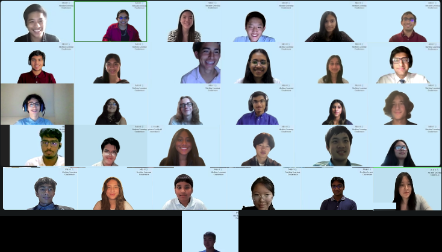

  

## Final Projects

### **From Coughs to Conversations: Fine-Tuning Whisper ASR for Medical Transcription** 

*Team ASR Aces: Hannah Thomas, Ileana Lim, Meghana Omkaram, Sara Pradhan*

Abstract: Transcription is vital in the medical field, encompassing tasks such as documenting medical conferences or telemedicine consultations and turning voice reports dictated by healthcare professionals into text. By fine-tuning the Whisper Small ASR (Automatic Speech Recognition) model for medical applications, we improve the accuracy of such transcriptions, allowing for a broader potential field of usage, including converting spoken patient information into accurate patient records and enabling healthcare professionals to directly dictate observations, recommendations, and notes into the system, eliminating time-consuming manual data entry. Through fine-tuning, our model achieved an orthographic WER (Word Error Rate) of 11.490% and a normalized WER of 7.309%, a significant reduction from the orthographic and normalized WERs of the non-fine-tuned model, which were 19.912% and 10.062% respectively. 

[Link to Poster](MedicalASR.png)

[Link to Paper](MedicalASR.pdf)

### **Using Deep-Q Learning to Optimize Rocket Launch Vehicles Performance** 

*Team Orion: Shiming He, Nayana Jayakumar, Ishan Venkatesh, Jason Huang*

Abstract: Spaceflight is one of the greatest engineering marvels humanity has developed. The first space missions began with mathematicians, scientists, engineers, and countless others who worked tirelessly to send the first vehicles into space. Since then, new opportunities has appeared in which modern technology improves the performance of launch vehicles (rocket) and spacecraft. This project continues this legacy by researching the use of reinforcement learning in launch vehicle trajectory optimization. Rocket trajectory optimization is an interplay of many different factors and is difficult to optimize to produce the best performance. To solve this problem, this project aims to use reinforcement learning model, Deep Q-learning (DQL), to create a model that allows for the optimization of launch trajectory where the goal is lifting a set payload to the highest and most circular orbit. The model in this project demonstrated the capability of DQL in optimizing the launch trajectory by providing a path to orbit that allows for better orbital performance under certain circumstances.  

[Link to Poster](RocketTrajectory.png)

[Link to Paper](RocketTrajectory.pdf)

### **An Enhanced Hybrid Diagnostic Deep Learning Framework using Ensemble ViT-ResNets for Oral Carcinoma Detection** 

*Team Smile Saviors: Ammad Hassan, Glen Shaji, Faaz Mohammed, Sai Konkimalla*

Abstract: Oral cancer detection can be approached using two distinct methods: a fast ‘System-1’ approach
that directly applies diagnostic models without extensive data processing, and a slower ‘System-
2’ approach that involves a detailed analysis. While System-2 approaches generally offer greater
accuracy, they are often computationally expensive and may not be feasible with limited datasets or
resources. Moreover, relying solely on either System-1 or System-2 methods overlooks the specific
needs and constraints of different diagnostic scenarios. To address these challenges, we propose
the Hybrid Diagnostic Framework, which balances between System-1 and System-2 methods
to enhance oral carcinoma detection. This framework includes: (i) fine-tuning pre-trained Vision
Transformer and Swin Transformer models on images, (ii) fine-tuning pre-trained ResNet-18 and
MobileNETV2 models on images, (iii) using evaluation metrics to identify the best transformer and
CNN architectures, and (iv) ensembling these models using the soft voting technique to combine
predictions. The system dynamically combines these methods based on the complexity of the
diagnostic task, optimizing performance and resource use. We fine-tuned and ensembled the models
on a single dataset, requiring only standard pre-processing and fine-tuning techniques. Experimental
results show that our Hybrid Diagnostic Framework outperforms traditional single-model approaches,
demonstrating key advantages: (1) adaptability by balancing between fast and detailed analyses, (2)
integration of diverse model architectures for improved diagnostic accuracy, and (3) robustness in
handling small, resource-limited datasets.

[Link to Poster](OralCancer.png)

[Link to Paper](OralCancer.pdf)

### **Solving AMC problems using Large Language Models** 

*Team The Math Whizzes: Bogdan Kremeznoy, Cindy Huang, Hale Tureli, Anhaar Wasi*

Abstract: AI has improved a lot over the past few years in domains like text summarizations and data categoriza-
tions. The aim of this project is to investigate how well the modern AI performs in logical reasoning.
Specifically, we assessed the performance of two Large Language Models (LLMs) – Mistral 7B
and Llama 3.1 8B – on the American Math Competition (AMC) after fine-tuning these models. For
fine-tuning, we used a dataset that contained the AMC problems. We evaluated the models based on
the accuracy before fine-tuning and after fine-tuning to see whether we were able to improve upon the
existing sources and which model performs better on average. However, as training large language
models requires large amounts of computational resources, we did not have access to large amounts
of GPU, and so the results are limited. However, we still observe some improvement upon baseline
performance when fine-tuning on problem-solving data: for Mistral 7B, the accuracy increased by
4.2% after fine-tuning, and for Llama 3.1 8B, the accuracy increased by 3.7% after fine-tuning. Based
on these promising results, we expect that with more computational power, we can achieve even
better performance.

[Link to Poster](AMCLLM.png)

[Link to Paper](AMCLLM.pdf)

### **Classification of fMRI Brain Images Based on Music Genres** 

*Team NeuroBeat: Chloe Cho, Andy Jiang, Aryan Jindal, Leonardo Medina*

Abstract: Functional magnetic resonance imaging (fMRI) brain images were analyzed to investigate the
neural correlates of music processing in response to five distinct genres: Ambient, Country, Heavy
Metal, Rock ’n Roll, and Classical Symphonic. Building upon previous work with a subset of 20
participants, we employed multiple machine learning algorithms (K-Nearest Neighbors, Support
Vector Machine, and regression models) to improve classification accuracy. Our results demonstrate
a significant improvement in accuracy, highlighting the potential of music-based analysis for
therapeutic applications. The study contributes to the growing body of research on the cognitive
effects of music, offering a novel methodology for analyzing fMRI data.

[Link to Poster](BrainMusic.png)

[Link to Paper](BrainMusic.pdf)

### **Podium to Perception: Sentiment Analysis in Political Speeches** 

*Team Sentiment Seekers: Dhrithi Guntaka, Mael-Camilo Lefevre Castaneda, Ayazhan Zhumakan, Lorenzo Rivera-Alvarez*

Abstract: Political discussions play a heavy role in today’s society, it often influences opinions and shapes communities. Due to its prevalence, understanding the tone and sentiment within political speeches is crucial. Our project analyzes the sentiment within political campaign speeches throughout the years using natural language processing (NLP) techniques. We originally implemented two models; the first uses one-hot encoding with linear regression and the second uses TF- IDF vectorization and linear regression. By calculating the Mean Square Error (MSE), we then determined the TF-IDF model was a better fit to providing the text that had not already been scored with a sentiment score. The TF- IDF model has an MSE score of 0.21, while the One- Hot Encoding model had an MSE score of 0.24. We were successfully able to determine the evolution of sentiment throughout a speech for various political figures.

[Link to Poster](SentimentPolitics.png)

[Link to Paper](SentimentPolitics.pdf)

### **Utilising CNNs for Hand Gesture Recognition** 

*Gesture Gurus: Aditi Jangra, Jerry Zheng, Mike Mitchell, Sushmit Chakma*

Abstract: Hand recognition plays a critical role in allowing humans to more easily interact with machines by
enabling another method of intuitive communication with digital devices. This study investigates the
use of Convolutional Neural Networks (CNNs) in recognizing various hand gestures. We utilized a
dataset consisting of 20,000 images. We experimented with many different types of CNNs, including:
VGG-16 and ResNet-18. By leveraging the spatial feature extraction capabilities of CNNs, we’ve built
an architecture for hand gesture recognition. This research provides insights into the application of
deep learning techniques for gesture recognition and suggests potential future directions for improving
interaction with digital devices in various domains such as medical and industrial applications.

[Link to Poster](HandGestureRecognition.jpg)

[Link to Paper](HandGestureRecognition.pdf)

### **Using Machine Learning for Metal Suitability in Lower Limb Prostheses** 

*Team Bionic Builders: Anirudh Bandaru, Sia Kripalani, Ece Akdogan*

Abstract: The development of advanced prosthetic limbs is pivotal in biomedical engineering, aiming to
enhance the quality of life for individuals with limb loss. This paper explores the integration of
machine learning to assess mechanical properties crucial for prosthetic leg design, including strength,
flexibility, and durability. Traditional methods relying on empirical testing are labor-intensive
and time-consuming. Leveraging advancements in materials science and mechanical engineering,
this study proposes a machine learning framework to predict material performance in prosthetic
applications. By analyzing a dataset comprising 1553 materials across key attributes such as Ultimate
Tensile Strength, Yield Strength, Elastic Modulus, and others, the study identifies 64 materials suitable
for prosthetic leg use. Safety assessments are conducted using Kernel Density Estimation, confirming
materials’ suitability based on their relationships with Poisson’s Ratio, Density, and mechanical
properties. The results highlight the efficacy of machine learning in accelerating material selection
processes and improving prosthetic design, aiming to advance rehabilitation and mobility for users
worldwide.

[Link to Poster](MetalsforProstheses.png)

[Link to Paper](MetalsforProstheses.pdf)

Code for these projects can be found [here](https://github.com/orgs/Mehta-AIMLResearchBootcamp24/repositories).

## Mid Projects
This year, for their midterm project, students worked with Prof. Elizabeth Macaulay from CUNY on a research project.

Studnets were presented with a dataset of UN archaeological gifts gifted by various countries and were tasked to understand why - why these gifts were given? Why did a country specifically choose to give this gift? Why did a country choose to give a gift to the UN a specific year? Many students used cutting-edge large language models (LLMs) such as GPT and Gemini and a technique called retrieval augmented generation to ensure that these LLMs would not hallucinate or make up facts, but rather hypothesis why certain gifts were given. 

Team 1 – [Link to Medium Article](https://medium.com/@mehtaplus/using-large-language-models-to-analyze-the-motives-behind-the-gifts-to-the-united-nations-8127b9cfbc72)

Team 2 – [Link to Medium Article](https://medium.com/@mehtaplus/why-is-a-gifted-un-artifact-significant-in-the-context-of-global-history-an-llm-study-f02ae6d6a4ff)

Team 3 – [Link to Medium Article](https://medium.com/@mehtaplus/creating-an-ai-chatbot-that-helps-understand-the-significance-of-a-un-gifted-artifact-3ce59c67cb5c)

Team 4 – [Link to Medium Article](https://medium.com/@mehtaplus/why-cultural-artifacts-gifted-to-the-un-were-created-a-comparison-of-several-large-language-0585fc819999)

Team 5 – [Link to Medium Article](https://medium.com/@mehtaplus/unveiling-archaeological-gifts-to-the-united-nations-a-computational-exploration-ce3fb751fe2b)

Team 6 – [Link to Medium Article](https://medium.com/@mehtaplus/significance-of-un-gifts-to-donor-country-a-text-based-automated-pipeline-53314effd494)

Team 7 – [Link to Medium Article](https://medium.com/@mehtaplus/ai-and-archaeology-how-can-they-cooperate-5777f7d2e6fe)
