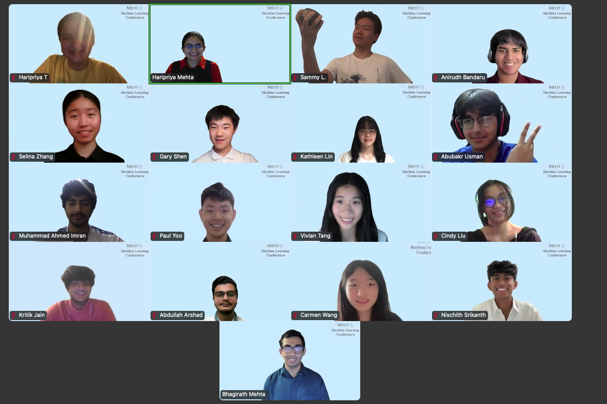

  

## Final Projects

### **ML-Driven Insights into the Geosocial Dynamics of Norman Sicily** 

*Team Silly Sicily: Nischith Srikanth, Vivian Tang, Carmen Wang, Selina Zhang*

Abstract: In this 3-part research project, we will analyze elevation patterns, analyze settlement patterns, and
construct a sustainable AI chatbot to facilitate interactive learning of Sicilian history. For the first
part, we used a combination of statistical and machine learning techniques to identify patterns and
correlations between elevation and other characteristics of the sites. Additionally, we employed
unsupervised machine learning methods such as k-means clustering, which allows spatial visualization
of these historical sites that can reveal geographic groupings and potential settlement trends. Moreover,
to help users track and find information more efficiently, we designed and developed a chatbot powered
by large language models (LLM), specifically GPT-4o from OpenAI. To ensure factual accuracy
and minimize hallucination and inferences from the chatbot, we integrated Retrieval-Augmented
Generation (RAG), allowing the chatbot to retrieve relevant information directly from a curated
dataset. The resulting system offers a user-friendly interface hosted on Streamlit. Ultimately, this
research bridges the disciplines of history and data science, offering an effective and interactive
solution to historical researchers and educators interested in both geographic and cultural insights.

[Link to Poster](NormanSicily.png)

[Link to Paper](NormanSicily.pdf)

### **Lost Leaves: ML Classification of Early Modern and Medieval Libraries** 

*Team Unbeleafable: Abubakr Usman, Cindy Liu, Kritik Jain*

Abstract: 

[Link to Poster](Library.png)

[Link to Paper](Library.pdf)

### **Codex Cognitio: Intelligent Reading of Renaissance Texts** 

*Back to the Future: Haripriya Tolety, Sammy Lei, Kathleen Lin, Anirudh Bandaru*

Abstract: 

[Link to Poster](HandGestureRecognition.jpg)

[Link to Paper](HandGestureRecognition.pdf)

### **Movie Dialogue Clustering for Character Comparison** 

*Team Cookie Fans: Gary Shen, Paul Yoo, Abdullah Arshad, Muhammad Ahmed Imran*

Abstract: 

[Link to Poster](MetalsforProstheses.png)

[Link to Paper](MetalsforProstheses.pdf)

Code for these projects can be found [here](https://github.com/orgs/Mehta-AIMLResearchBootcamp24/repositories).

## Mid Projects
This year, for their midterm project, students worked with PhD student, Ms. Holly Brown from University of Birmingham on a research project.

Students were presented with three works by 15th century Iberian women writers written in Castilian Spanish and Catalan. They were tasked to identify rhetorical devices and annotate the texts. Many students used natural language processing models like BERT and large language models (LLMs) such as Gemini to create an annotation pipeline. 

Team 1 – [Link to Medium Article](https://medium.com/@mehtaplus/identifying-rhetorical-devices-in-spanish-and-catalan-literature-b44a9998f6c0)

[Link to Presentation](midterm1.pdf)

Team 2 – [Link to Medium Article]()

[Link to Presentation](midterm2.pdf)

Team 3 – [Link to Medium Article]()

[Link to Presentation](midterm3.pdf)

Team 4 – [Link to Medium Article]()

[Link to Presentation](midterm4.pdf)