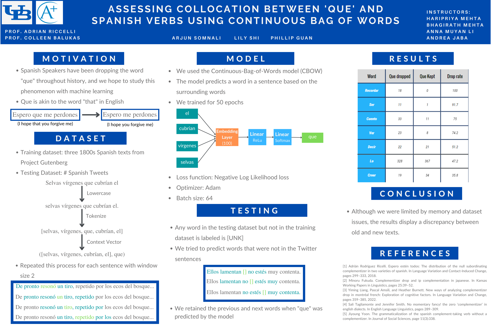
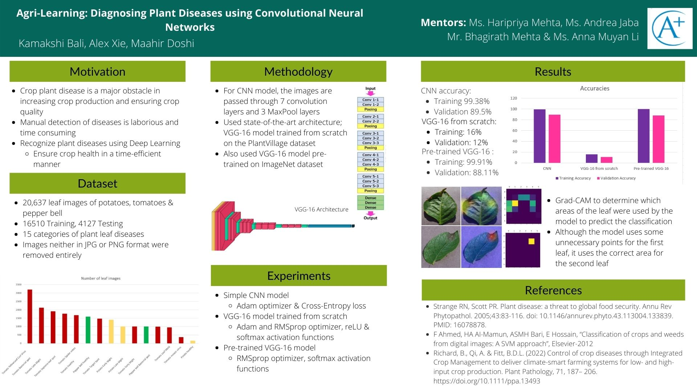
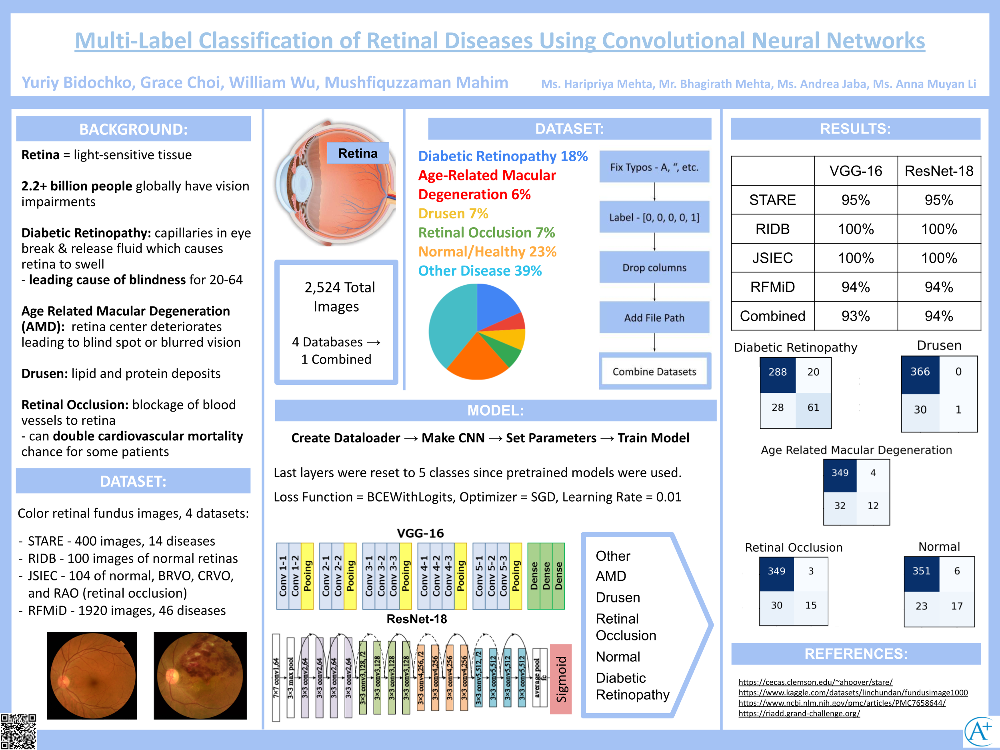

# MehtA+ AI/Machine Learning Research Bootcamp Projects

 
  
  
  
 

Each summer, MehtA+ offers a 6-week AI/Machine Learning Research Bootcamp where students learn the theory and application of AI and machine learning and then apply these techniques to a digital humanities or science project with a real world impact. Here are 10 super cool projects that students have worked on. 

1) Predicting weather-related flight delays
2) Dating an Italian philosopher's texts using handwriting recognition
3) Training an AI to mimick the chess skills of an amateur chess player
4) Classifying whether a patient has melanoma using images of skin lesions
5) Charting the evolution of the word "que" in the Spanish language 
6) Analyzing sentiment of tweets for stock price prediction. 
7) Detecting Fake News
8) Determining the author of disputed Federalist papers
9) Building a Latin translator
10) Detecting Credit Card Fraud 

We graciously thank the following universities who we have partnered up with for this program. While MehtA+ instructors focused on mentoring students in the AI/machine learning aspects of the projects during the bootcamp, professors from these universities volunteered their time and provided datasets and domain knowledge as students worked on active areas of research. Many of our students have also gone on to research in these professors' labs after the bootcamp and are working on getting published!

1) Haverford College
2) Kenyon College
3) Singapore Institute of Technology
4) Northeastern University
5) University of Bologna, Italy
6) University of Buffalo SUNY 

Check us out at Northeastern University's Women Writers Project blog! - https://wwp.northeastern.edu/blog/machine-learning/

## Student Projects 
Click on the different years to check out the past final and mid projects for AI/Machine Learning Research Bootcamp. We have posted students' poster presentations, technical papers and websites. 

[Past Projects - 2022](2022)

[Past Projects - 2021](2021)

[Past Projects - 2020](2020)

If you have any questions, please reach out to info@mehtaplustutoring.com and make sure to join our mailing list!
